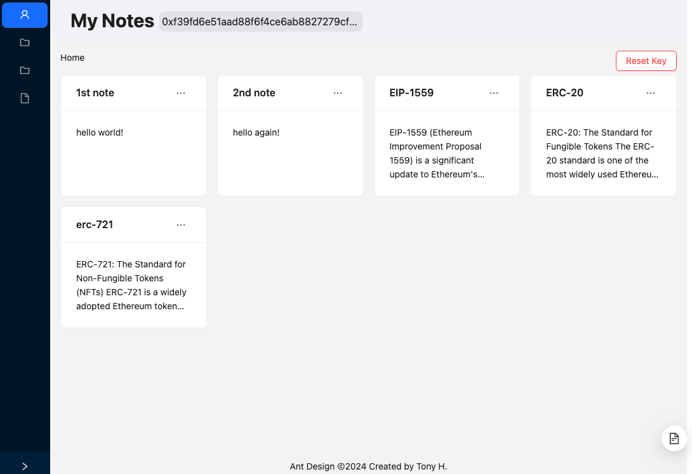

# Personal Note-taking DApp 

Web App Stacks: Vite, React, ethers.js \
Development tools: Hardhat, Solidity, Remix

## Project Introduction

### Goal
1. A personal private note-taking app based on account address
2. Implement CRUD functions with Metamask
3. Store your notes on blockchain


### Note Structure
```bash
{
    id: _id,
    content: {
        title: _title,
        text: _text
    }
}
```
P.S. Note is extendable, such as adding 'tags', 'label'... in 'content'




## How to start?

### Install Hardhat
We will be using a Hardhat node to simulate the blockchain environment. \
Our dapp will run on this local node. \

Here is how to set up a Hardhat development environment. \
(https://hardhat.org/hardhat-runner/docs/getting-started)

`deploy.js` and `Notes.sol` are used in hardhat development.

### Run Hardhat node and deploy smart contract
Once finishing setting up,

1. Start a local hardhat node
    ```bash
    npx hardhat node
    ```
2. Deploy our note smart contract
    ```bash
    npx hardhat run scripts/deploy.js --network localhost
    ```

### Run dapp
* Run in developing mode,
    ```bash
    npm run dev
    ```
* or, build and run app
    ```bash
    npm run build
    npm run preview
    ```

## Utilities

### Set up your notes encryption/decryption key: 
```bash
node src/utils/create_symmetric_key.js
```
Write down this key. It will be used to view and secure your notes. \
Once lost, the existed notes won't be able to view again.

### Encryption and Decryption
Every note stored on blockchain is encrypted with an user-defined key.
The encryption process will compress the content first to reduce the size before encryption.
The decryption process will first decrypt the data receving from blockchain and then decompress.

## In the future

1. store keys using Metamask Snaps
2. show transaction page, block explorer
3. add tags, labels for notes
4. store encrypted notes on IPFS such as pinata and infura

